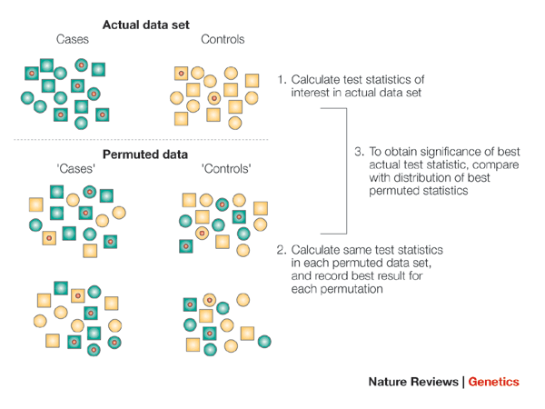
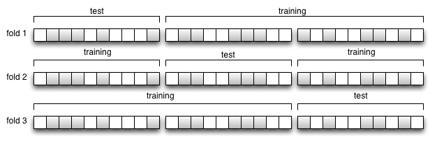
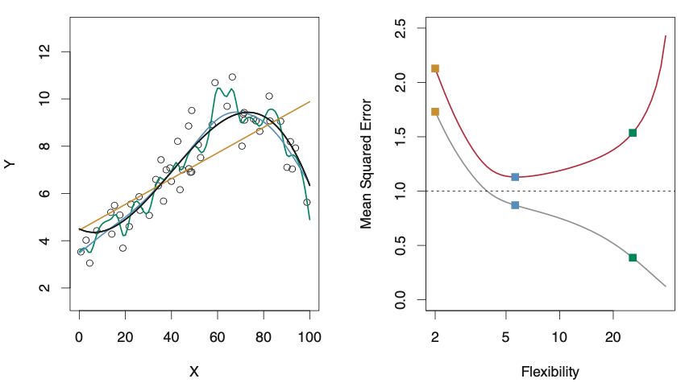
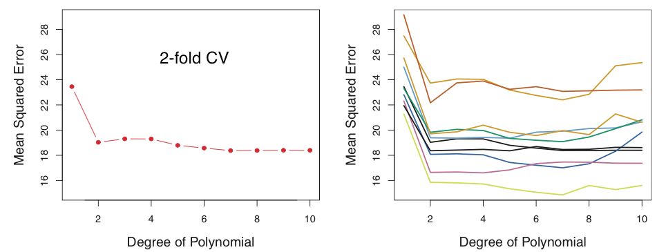
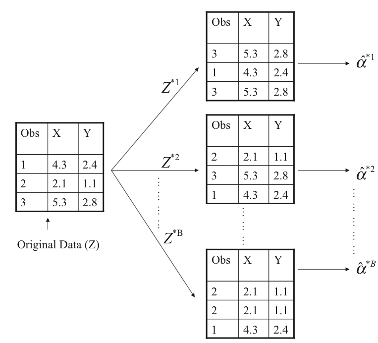

```{r setup, include=FALSE}
knitr::opts_chunk$set(echo = TRUE, cache = TRUE)
```

## 세션 2 개요

- 범주형 변수에 대한 가설 검정
    - Fisher의 정확 검정 및 카이제곱 검정 (["연관성 검정" 책 섹션](https://genomicsclass.github.io/book/pages/association_tests.html))

- 리샘플링 방법
    + ["순열 검정" 책 섹션](https://genomicsclass.github.io/book/pages/permutation_tests.html)
    + [교차 검증 책 섹션](https://genomicsclass.github.io/book/pages/crossvalidation.html)
    + 부트스트랩 시뮬레이션 (Introduction to Statistical Learning 섹션 5.2 참조: https://www.statlearning.com/)

- [탐색적 데이터 분석](https://genomicsclass.github.io/book/pages/exploratory_data_analysis.html)

## 범주형 변수에 대한 가설 검정

- 하나 또는 두 개의 연속형 변수에 대한 가설 검정 및 신뢰 구간 복습:
    - *Z-검정, t-검정, 상관 관계*

- 두 개의 이진 변수:
    - Fisher의 정확 검정
    - Pearson의 카이제곱 검정

## 차를 맛보는 부인

- 문제의 부인은 컵에 차를 먼저 넣었는지 우유를 먼저 넣었는지 구별할 수 있다고 주장했습니다.
- Fisher는 그녀에게 각각 4개씩, 무작위 순서로 **8개**의 컵을 제공할 것을 제안했습니다.
    - 부인은 실험 방법에 대해 **완전히 알고** 있습니다.
    - $H_0$: 부인은 어느 것이 먼저 추가되었는지 구별할 능력이 없습니다.

<center>

</center>

출처: https://en.wikipedia.org/wiki/Lady_tasting_tea

## Fisher의 정확 검정

p-값은 $H_0$ 하에서 관찰된 성공 횟수 또는 그 이상의 확률입니다.

<table>
<caption>차 맛보기 분포</caption>
<tr>
<th scope="col">성공 횟수</th>
<th scope="col">선택 순열</th>
<th scope="col">순열 수</th>
</tr>
<tr>
<td>0</td>
<td>oooo</td>
<td>1 × 1 = 1</td>
</tr>
<tr>
<td>1</td>
<td>ooox, ooxo, oxoo, xooo</td>
<td>4 × 4 = 16</td>
</tr>
<tr>
<td>2</td>
<td>ooxx, oxox, oxxo, xoxo, xxoo, xoox</td>
<td>6 × 6 = 36</td>
</tr>
<tr>
<td>3</td>
<td>oxxx, xoxx, xxox, xxxo</td>
<td>4 × 4 = 16</td>
</tr>
<tr>
<td>4</td>
<td>xxxx</td>
<td>1 × 1 = 1</td>
</tr>
<tr>
<th colspan="2" scope="row">총계</th>
<td>70</td>
</tr>
</table>

* x = 정답, o = 오답

이 모든 조합에서 무엇을 알 수 있습니까?

* 각 조합은 네 번의 추측만 포함합니다.
* 우유를 먼저 넣은 컵이 몇 개인지 모르면 훨씬 더 많은 추측이 가능했을 것입니다.

## Fisher의 정확 검정에 대한 참고 사항

- $r \times c$ 표에도 적용할 수 있습니다.
- 표의 여백은 *설계에 의해 고정*된다는 점을 기억하십시오.
- 단일 꼬리 버전(유전자 집합 농축 분석에 사용)은 초기하 검정이라고 합니다.
- 큰 표본에 대해서는 정확한 p-값을 계산하기 어렵습니다(그리고 불필요합니다).
    - `fisher.test(x, y = NULL, etc, simulate.p.value = FALSE)`

## Fisher의 정확 검정 응용

- 유전자 집합 분석 등에 (위험하게) 적용되었습니다. 예:
    - 상위 100개 유전자 중 10개가 세포분열 GO 용어로 주석 처리되었습니다.
    - 21,000개 인간 유전자 중 465개가 세포분열 GO 용어로 주석 처리되었습니다.
    - 내 상위 100개 유전자가 세포분열 과정에 농축되어 있습니까?
- 이 분석의 문제점:
    - 주요 문제: 상위 n개 유전자는 상관 관계가 있는 경향이 있으므로 선택이 독립적인 시행이 아닙니다.
    - 부차적 문제: $H_0$에 대한 설계와 일치하지 않습니다.

- 유전자 집합 분석에는 많은 대안적 접근 방식이 있지만 이 접근 방식은 통계학자들이 생각했던 것만큼 나쁘지는 않습니다. 다음을 참조하십시오.

Geistlinger _et al._ Toward a gold standard for benchmarking gene set enrichment analysis. Brief. Bioinform. (2020) [doi:10.1093/bib/bbz158](http://dx.doi.org/10.1093/bib/bbz158)
    

## 카이제곱 검정

- $r \times c$ 표(두 범주형 변수)에 대한 독립성 검정
- 여백이 설계에 의해 고정된다고 가정하지 않습니다.
    - 즉, 각 찻잔에 우유를 먼저 따르는지 여부는 동전 던지기로 결정되며, 부인은 몇 개인지 모릅니다.
    - 실제로는 더 일반적입니다.
    - 고전적인 유전체학 예는 GWAS입니다.
- $H_0$: 두 변수는 독립적입니다.
- $H_A$: 변수 간에 연관성이 있습니다.

## GWAS에 적용

* 질병과 일부 잠재적 원인 인자 간의 연관성에 관심이 있습니다.
* 환자-대조군 연구에서는 환자 및 대조군의 수는 고정되지만 다른 변수는 고정되지 않습니다.
* 전향적 또는 종단적 코호트 연구에서는 사례 수나 다른 변수 모두 고정되지 않습니다.

```{r, echo=FALSE}
disease = factor(c(rep(0, 180), rep(1, 20), rep(0, 40), rep(1, 10)),
                 labels = c("control", "cases"))
genotype = factor(c(rep("AA/Aa", 204), rep("aa", 46)),
                  levels = c("AA/Aa", "aa"))
dat <- data.frame(disease, genotype)
set.seed(1)
dat <- dat[sample(nrow(dat)), ] #shuffle them up
summary(dat)
```

## 카이제곱 검정 적용

```{r}
table(disease, genotype)
chisq.test(disease, genotype)
chisq.test(disease, genotype, simulate.p.value = TRUE)
```

* 카이제곱 검정 p-값은 근사치이며, $r \times c$ 표의 작은 셀(예: 5 미만)에서는 부정확성이 증가합니다.
* $simulate.p.value$는 $H_0$가 카이제곱 검정에 해당하는 경우 Fisher의 정확 검정을 사용하는 것보다 작은 개수를 처리하는 더 유효한 방법입니다.
* Fisher의 정확 검정은 다른 가설에 대한 정확한 p-값을 제공합니다.

## 승산비 계산

* 결과는 독립성으로부터의 이탈이 *어떻게* 발생하는지에 대해서는 아무것도 말해주지 않습니다.
* 승산비는 그렇게 합니다.

```{r}
library(epitools)
epitools::oddsratio(genotype, disease, method = "wald")$measure
```

## 요인 참조 수준에 대한 참고 사항

요인의 참조 수준을 변경하려면 `relevel()` 함수를 사용하거나 `dplyr::recode_factor()`를 사용하십시오.

```{r}
epitools::oddsratio(relevel(genotype, "aa"), disease)$measure
```

(기본값은 알파벳순으로 첫 번째 수준입니다!)

## 요약 - 두 개의 범주형 변수

- Fisher의 정확 검정과 카이제곱 검정 간의 선택은 실험 설계에 따라 결정됩니다.
- 표의 개수가 5보다 작은 경우 `simulate.p.value=TRUE`를 사용하여 카이제곱 검정에서 더 정확한 p-값을 얻을 수 있습니다.
- 둘 다 독립적인 관찰을 가정합니다(중요!!).
- GWAS에서는 다중 검정에 대한 수정이 필요합니다.

# 리샘플링 방법

## 리샘플링 방법의 주요 유형

* 리샘플링은 사용 가능한 하나의 표본에서 반복적인 표본을 시뮬레이션하는 것을 포함합니다.
    - *순열 검정*: 경험적 귀무 분포를 생성하기 위해 레이블을 섞습니다.
    - *교차 검증*: _비복원_으로 훈련 세트와 테스트 세트를 생성합니다.
    - *부트스트랩*: 크기 $n$의 표본을 _복원_으로 생성합니다.

## 순열 검정

참 $H_0$을 보장하기 위해 반응 (y) 변수를 순열합니다.

<center>

</center>

<font size="2">
일반적인 질병 및 복잡한 특성에 대한 전체 유전체 연관 연구. *Nature Reviews Genetics 6*, 95-108 (2005년 2월).
</font>

## 순열 검정

- 각 순열에 대한 검정 통계량을 계산합니다.
    - 999가 일반적인 숫자입니다.
- P-값은 순열 검정 통계량의 "경험적 귀무 분포"에서 실제 검정 통계량의 분위수입니다.
- 순열 검정은 *여전히 가정 사항이 있습니다*:
    - 표본은 독립적이고 "교환 가능"하다고 가정합니다.
    - 가족과 같은 숨겨진 구조는 반보수적인 p-값을 유발할 수 있습니다.

## K-겹 교차 검증: 설정

* 설정: 추론과 반대되는 예측
* 잠재적 용도:
    1. 데이터를 모델에 맞게 조정
    2. 과적합으로 인한 부풀려진 예측 정확도 보고 방지
    3. 단일 데이터 세트에서 경쟁 알고리즘의 정확도 비교

<center>


3겹 교차 검증

</center>

## 정의: 훈련, 검증, 테스트

* 모델은 처음에 **훈련 데이터 세트**에 적합화됩니다.
* 연속적으로 적합화된 모델은 **검증 데이터 세트**라는 두 번째 데이터 세트의 관찰에 대한 응답을 예측하는 데 사용됩니다. 검증 데이터 세트는 다른 모델에서 선택하기 위해 반복적으로 사용될 수 있습니다.
* 마지막으로 **테스트 데이터 세트**는 훈련 데이터 세트에 적합화된 *최종 모델*의 편향되지 않은 평가를 제공하는 데 사용되는 데이터 세트입니다.

<font size="2">
https://en.wikipedia.org/wiki/Training,_validation,_and_test_sets
</font>

## 튜닝: 훈련 세트 및 검증 세트 오류

<center>


ISLR 그림 2.9: 훈련 세트 대 검증 세트 오류: U자형 곡선

</center>

* 훈련 세트 오류는 항상 더 유연한 모델에서 감소했습니다.
* 검증 세트 오류는 U자형 경향이 있습니다. 모델 "튜닝"은 이 낮은 지점을 찾습니다.
* 튜닝을 위한 교차 검증은 독립적인 정확도 추정을 위한 교차 검증과 같지 않습니다.

<font size="2">
James, Witten, Hastie, Tibshirani.  An Introduction to Statistical Learning with Applications in R. Springer, 2014. https://www.statlearning.com/

그림 2.9. 왼쪽: f에서 시뮬레이션된 데이터(검은색으로 표시됨). f의 세 가지 추정치가 표시됩니다: 선형 회귀선(주황색 곡선)과 두 개의 평활 스플라인 적합(파란색 및 녹색 곡선). 오른쪽: 훈련 MSE(회색 곡선), 테스트 MSE(빨간색 곡선) 및 모든 방법에 대한 최소 가능 테스트 MSE(점선). 사각형은 왼쪽 패널에 표시된 세 가지 적합에 대한 훈련 및 테스트 MSE를 나타냅니다.
</font>

## K-겹 교차 검증: 알고리즘

* 크기 $n$의 표본에서 $K$개의 "겹"을 만듭니다. $K \le n$
1. 검증 세트로 $1/K$개의 관찰을 무작위로 표본 추출합니다(비복원).
2. 나머지 표본을 훈련 세트로 사용합니다.
3. 훈련 세트에서 모델을 적합화하고 검증 세트에서 정확도를 추정합니다.
4. 동일한 검증 표본을 사용하지 않고 $K$번 반복합니다.
5. 각 검증 세트의 평균 검증 정확도를 계산합니다.

## 교차 검증의 변동성

<center>


ISLR 그림 5.2: 2겹 교차 검증의 변동성
</center>

* 교차 검증을 여러 번 반복한 다음 결과를 평균화하는 것을 _평활화_라고 합니다.
* 매번 다른 무작위 훈련 및 검증 세트를 선택하는 것을 _몬테카를로 교차 검증(MCCV)_이라고 합니다.

<font size="2">
James, Witten, Hastie, Tibshirani.  An Introduction to Statistical Learning with Applications in R. Springer, 2014. https://www.statlearning.com/

그림 5.2. Auto 데이터 세트에서 마력의 다항 함수를 사용하여 mpg를 예측한 결과 발생하는 테스트 오류를 추정하기 위해 검증 세트 접근 방식을 사용했습니다. 왼쪽: 훈련 및 검증 데이터 세트로 한 번 분할한 경우의 검증 오류 추정치. 오른쪽: 검증 방법을 10번 반복했으며, 매번 관찰을 훈련 세트와 검증 세트로 다르게 무작위 분할했습니다. 이는 이 접근 방식에서 발생하는 추정된 테스트 MSE의 변동성을 보여줍니다.
</font>

## 교차 검증 요약

* 예측 모델링에서 데이터를 _훈련_ 또는 _테스트_로 생각합니다.
     - 교차 검증은 훈련 세트에서 테스트 세트 오류를 추정하는 방법입니다.
* 훈련 세트 오류는 항상 더 복잡한(유연한) 모델에서 감소합니다.
* 모델 유연성의 함수로서의 테스트 세트 오류는 U자형 경향이 있습니다.
     - U의 낮은 지점은 가장 적절한 모델 복잡성 수준을 나타냅니다.

## 부트스트랩 요약

* 부트스트랩은 표준 오차와 같은 불확실성을 추정하는 매우 일반적인 접근 방식입니다.
* 광범위한 모델 및 통계에 적용할 수 있습니다.
* 이상치 및 모델 가정 위반에 강건합니다.
* 기본 접근 방식:
    1. 사용 가능한 표본(크기 $n$)을 사용하여 크기 $n$의 새 표본을 생성합니다(복원 추출).
    2. 관심 있는 통계량을 계산합니다.
    3. 반복합니다.
    4. 반복된 실험을 사용하여 관심 있는 통계량의 변동성을 추정합니다.

## 부트스트랩 (개략도)

<center>

</center>

# 탐색적 데이터 분석

## 소개

> "그림의 가장 큰 가치는 우리가 전혀 예상하지 못했던 것을 주목하게 만들 때입니다." - John W. Tukey

- 데이터의 편향, 체계적 오류 및 예상치 못한 변동성을 발견합니다.
- 이러한 문제를 감지하기 위한 그래픽 접근 방식입니다.
- 데이터 분석의 첫 번째 단계를 나타내며 가설 검정을 안내합니다.
- 이상치에서 발견의 기회가 있습니다.

## 분위수-분위수 그림

- 분위수는 분포를 동일한 크기의 구간으로 나눕니다.
- 100개의 구간으로 나누면 백분위수가 됩니다.
- 이론적 분포의 분위수를 실험적 분포에 대해 그립니다.
    - 또는 두 실험적 분포의 분위수를 그립니다.
- 완벽하게 적합하면 $x=y$입니다.
- 데이터 분포(정규, t 등)를 결정하는 데 유용합니다.

## 예: 분위수-분위수 그림

```{r echo=FALSE, fig.width=8}
suppressPackageStartupMessages(library(UsingR))
suppressPackageStartupMessages(library(rafalib))
# height qq plot
x <- father.son$fheight
ps <- (seq(0, 99) + 0.5) / 100
qs <- quantile(x, ps)
normalqs <- qnorm(ps, mean(x), popsd(x))
par(mfrow = c(1, 3))
plot(normalqs,
     qs,
     xlab = "정규 백분위수",
     ylab = "키 백분위수",
     main = "키 Q-Q 그림")
abline(0, 1)
# 12 df에 대한 t-분포
x <- rt(1000, 12)
qqnorm(x,
       xlab = "t 분위수",
       main = "T 분위수 (df=12) Q-Q 그림",
       ylim = c(-6, 6))
qqline(x)
# 3 df에 대한 t-분포
x <- rt(1000, 3)
qqnorm(x,
       xlab = "t 분위수",
       main = "T 분위수 (df=3) Q-Q 그림",
       ylim = c(-6, 6))
qqline(x)
```

## 상자 그림: 정보

- 데이터가 정규 분포를 따르지 않는 경우 해석하기 쉬운 그래프를 제공합니다.
- 분포가 매우 치우쳐 있으므로 소득 데이터를 탐색하는 데 적절한 선택입니다.
- 특히 이상치 및 범위와 관련하여 유익합니다.
- 여러 분포를 나란히 비교할 수 있습니다.

## 상자 그림: 예

```{r echo=FALSE, fig.width=8, fig.height=4}
par(mfrow=c(1, 3))
hist(exec.pay, main = "CEO 보수")
qqnorm(exec.pay, main = "CEO 보수")
boxplot(exec.pay, ylab="10,000달러", ylim=c(0,400), main = "CEO 보수")
```
<center>
연속형 변수의 세 가지 다른 보기
</center>

## 산점도 및 상관 관계: 정보

- 두 개의 연속형 변수의 경우 산점도 및 상관 관계 계산이 유용합니다.
- 관계의 그래픽 및 수치적 추정을 제공합니다.
- `plot()` 및 `cor()`를 사용하여 빠르고 쉽습니다.

## 산점도 및 상관 관계: 예

```{r echo=FALSE, fig.width=8, fig.height=4}
par(mfrow=c(1,3))
plot(father.son$fheight, father.son$sheight,xlab="아버지 키 (인치)",ylab="아들 키 (인치)",main=paste("상관 관계 =",signif(cor(father.son$fheight, father.son$sheight),2)))
plot(cars$speed, cars$dist,xlab="속도",ylab="정지 거리",main=paste("상관 관계 =",signif(cor(cars$speed, cars$dist),2)))
plot(faithful$eruptions, faithful$waiting,xlab="분출 지속 시간",ylab="대기 시간",main=paste("상관 관계 =",signif(cor(faithful$eruptions, faithful$waiting),2)))
```

## 고차원에서의 탐색적 데이터 분석

```{r, echo=FALSE, message=FALSE}
if(!require(GSE5859Subset)){
  BiocManager::install("genomicsclass/GSE5859Subset")
}
```

```{r}
library(GSE5859Subset)
data(GSE5859Subset) ##this loads three tables # 세 개의 테이블을 로드합니다
c(class(geneExpression), class(sampleInfo))
rbind(dim(geneExpression), dim(sampleInfo))
head(sampleInfo)
```

## 화산 그림: 설정

유전자 발현 행렬의 모든 행(유전자)에 대한 T-검정:
```{r, message=FALSE}
library(genefilter)
g <- factor(sampleInfo$group)
system.time(results <- rowttests(geneExpression, g))
pvals <- results$p.value
```

이 8,793개의 검정은 약 0.01초 만에 완료됩니다.

## 화산 그림: 예

```{r, fig.height=3, fig.width=6}
par(mar = c(4, 4, 0, 0))
plot(results$dm,
     -log10(results$p.value),
     xlab = "효과 크기 (그룹 평균의 차이)",
     ylab = "- log (밑 10) p-값")
abline(h = -log10(0.05 / nrow(geneExpression)), col = "red")
legend("bottomright",
       lty = 1,
       col = "red",
       legend = "Bonferroni = 0.05")
```

## 화산 그림: 요약

- 효과 크기가 작은 많은 작은 p-값은 그룹 내 변동성이 낮음을 나타냅니다.
- 비대칭성을 검사합니다.
- 유의성 임계값에 따라 점을 색칠할 수 있습니다.

## P-값 히스토그램: 설정

- 모든 귀무 가설이 참이면 p-값의 평평한 히스토그램이 예상됩니다.

```{r}
m <- nrow(geneExpression)
n <- ncol(geneExpression)
set.seed(1)
randomData <- matrix(rnorm(n * m), m, n)
nullpvals <- rowttests(randomData, g)$p.value
```

## P-값 히스토그램: 예

```{r, echo=FALSE, fig.height=3}
par(mfrow = c(1, 2))
hist(pvals, ylim = c(0, 1400))
hist(nullpvals, ylim = c(0, 1400))
```

## P-값 히스토그램: 예 2 (순열)

이러한 데이터를 순열해도 배치 효과로 인해 이상적인 귀무 p-값 히스토그램이 생성되지 않습니다.

```{r, fig.height=3}
permg <- sample(g)
permresults <- rowttests(geneExpression, permg)
hist(permresults$p.value)
```

## P-값 히스토그램: 요약

- 얼마나 많은 유의미한 p-값이 있을 수 있는지 빠르게 살펴볼 수 있습니다.
- 순열된 레이블을 사용할 때 표본 간의 비독립성을 노출할 수 있습니다.
    + 배치 효과 또는 가족 구조 때문일 수 있습니다.
- 배치 효과를 수정하는 가장 일반적인 접근 방식은 다음과 같습니다.
    + `ComBat`: 선형 모델로 알려진 배치 효과를 수정합니다.
    + `sva`: 알 수 없는 배치 효과에 대한 대리 변수를 만들고 순열 p-값의 구조를 수정합니다.
    + 대조군(하우스키핑) 유전자를 사용한 수정

모두 [sva](https://www.bioconductor.org/packages/sva) Bioconductor 패키지에서 사용할 수 있습니다.

## MA 그림

- 산점도를 45도 회전한 것입니다.

```{r, fig.height=3}
rafalib::mypar(1, 2)
pseudo <- apply(geneExpression, 1, median)
plot(geneExpression[, 1], pseudo)
plot((geneExpression[, 1] + pseudo) / 2, (geneExpression[, 1] - pseudo))
```

## MA 그림: 요약

- 고차원 데이터의 품질 관리에 유용합니다.
- 표본의 모든 데이터 값을 다른 표본 또는 중앙값 "유사 표본"에 대해 그립니다.
- `affyPLM::MAplots` 더 나은 MA 그림
    - 수평선으로부터의 이탈을 강조하기 위해 평활선을 추가합니다.
    - 많은 데이터 포인트 대신 "구름"을 그립니다.

## 히트맵

* 고차원 데이터 세트의 상세한 표현.
    - `ComplexHeatmap` 패키지는 2023년 현재 최고입니다: 대용량 데이터 세트, 대화형 히트맵, 간단한 기본값이지만 많은 사용자 지정이 가능합니다.

```{r, fig.width=12}
suppressPackageStartupMessages(library(ComplexHeatmap))
keep <- rank(apply(geneExpression, 1, var)) <= 100  # 500 most variable genes # 가장 변동성이 큰 500개 유전자
ge <- geneExpression[keep, ]
ge <- t(scale(t(ge))) #scale # 스케일링
rownames(ge) <- NULL; colnames(ge) <- NULL
chr <- sub("chr", "", geneAnnotation$CHR)
chr[is.na(chr)] <- "Un"
chr <- factor(chr, levels = c(1:22, "Un", "X", "Y"))
chrcols <- list(chromosome = c(colorRampPalette(c("lightgrey", "black"))(22), "white", "pink", "blue"))
names(chrcols[["chromosome"]]) <- c(1:22, "Un", "X", "Y")
row_ha <- rowAnnotation(chromosome = chr[keep], col = chrcols, na_col = "white")
column_ha <- HeatmapAnnotation(ethnicity = sampleInfo$ethnicity, group = factor(sampleInfo$group),
                               col = list(ethnicity = c("ASN"="lightgrey", "CEU"="darkgrey"),
                                          group = c("0" = "brown", "1" = "blue")))
Heatmap(ge, use_raster = FALSE, top_annotation = column_ha, right_annotation = row_ha)
```

## 히트맵: 요약

- 수천 개의 행에 대해 클러스터링이 느려지고 메모리 집약적이 됩니다.
    - 아마도 수천 개의 행에는 너무 상세할 것입니다.
- 공동 발현 유전자, 표본 그룹을 표시할 수 있습니다.

## 색상

- 색상 팔레트 유형:
    - **순차적**: 그라데이션을 표시합니다.
    - **발산적**: 중심에서 두 방향으로 이동합니다.
    - **질적**: 범주형 변수에 사용됩니다.
- 색맹을 염두에 두십시오(모든 남성의 10%).

## 색상 (계속)

`RColorBrewer` 패키지와 `colorRampPalette()`를 조합하면 원하는 모든 것을 만들 수 있습니다.

```{r, fig.height=5, echo=FALSE}
rafalib::mypar(1, 1)
RColorBrewer::display.brewer.all(n = 7)
```

## 피해야 할 그림

> "원형 차트는 정보를 표시하는 매우 나쁜 방법입니다." - R 도움말

- 항상 원형 차트를 피하십시오.
- 도넛 차트도 피하십시오.
- 가짜 3D 및 대부분의 Excel 기본값을 피하십시오.
- 효과적인 그래프는 색상을 신중하게 사용합니다.

## 실습

* [순열 검정 연습 문제](https://genomicsclass.github.io/book/pages/permutation_tests_exercises.html)
* [연관성 검정 연습 문제](https://genomicsclass.github.io/book/pages/association_tests_exercises.html)
* [EDA 연습 문제 **1-3만**](https://genomicsclass.github.io/book/pages/exploratory_data_analysis_exercises.html)

## 링크

- 이 강의의 빌드된 [html][] 버전이 제공됩니다.
- [소스][] R Markdown은 Github에서도 제공됩니다.

[html]: https://rpubs.com/lwaldron/AppStatBio2023_day2
[source]: https://github.com/waldronlab/AppStatBio
