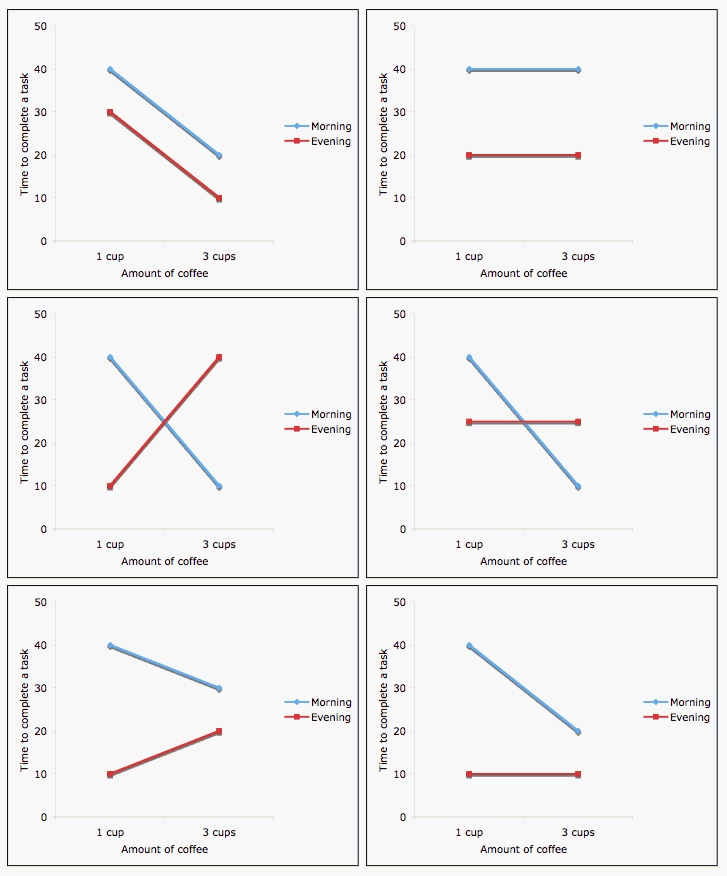

```{r setup, include=FALSE}
knitr::opts_chunk$set(eval = TRUE)
```

## 개요

-   다중 선형 회귀
    -   연속형 및 범주형 예측 변수
    -   상호작용
-   모델 공식
-   일반화 선형 모델
    -   선형, 로지스틱, 로그-선형 연결 함수
    -   푸아송, 음이항 오류 분포
-   다중 가설 검정

교재 출처:

-   5장: 선형 모델
-   6장: 고차원 데이터 추론

## 예: 거미 다리의 마찰

::: columns-2
<center>


</center>

-   **(A)** 해당 다리의 총 발톱 술 면적을 보여주는 막대 그래프.
-   **(B)** 마찰 계수 데이터를 보여주는 상자 그림으로 중앙값, 사분위수 범위 및 극단값을 나타냅니다.
:::

-   Wolff & Gorb, [야누스 같은 강모의 방사상 배열은 거미의 마찰 제어를 가능하게 합니다](http://www.nature.com/articles/srep01101), *Sci. Rep.* 2013.

## 질문

::: columns-2
<center>


</center>

-   당기는 마찰 계수와 미는 마찰 계수는 다른가요?
-   다른 다리 쌍에 대해 마찰 계수가 다른가요?
-   당기는 마찰 계수와 미는 마찰 계수의 차이가 다리 쌍에 따라 다른가요?
:::

## 정성적 답변

```{r, echo=FALSE}
url <- "https://raw.githubusercontent.com/genomicsclass/dagdata/master/inst/extdata/spider_wolff_gorb_2013.csv"
filename <- "spider_wolff_gorb_2013.csv"
library(downloader)
if (!file.exists(filename))
    download(url, filename)
spider <- read.csv(filename, skip=1)
```

```{r}
table(spider$leg,spider$type)
summary(spider)
```

```{r, fig.align='center'}
boxplot(spider$friction ~ spider$type * spider$leg,
        col=c("grey90","grey40"), las=2,
        main="다른 다리 쌍의 마찰 계수")
```

::: columns-2
```{r, fig.align='center', echo=FALSE}
boxplot(spider$friction ~ spider$type * spider$leg,
        col=c("grey90","grey40"), las=2,
        main="다른 다리 쌍의 \n 마찰 계수")
```

참고:

-   당기는 마찰이 더 높습니다.
-   당기는 마찰(미는 마찰은 아님)은 뒤쪽 다리일수록 증가합니다 (L1 -> 4).
-   분산은 일정하지 않습니다.
:::

## 선형 모델이란 무엇인가요?

다음은 선형 모델의 예입니다:

1.  $Y_i = \beta_0 + \beta_1 x_i + \varepsilon_i$ (단순 선형 회귀)
2.  $Y_i = \beta_0 + \beta_1 x_i + \beta_2 x_i^2 + \varepsilon_i$ (이차 회귀)
3.  $Y_i = \beta_0 + \beta_1 x_i + \beta_2 \times 2^{x_i} + \varepsilon_i$ ($2^{x_i}$는 새로운 변환 변수입니다)

## 다중 선형 회귀 모델

-   선형 모델은 임의의 수의 예측 변수를 가질 수 있습니다.
-   모델의 체계적 부분:

$$
E[y|x] = \beta_0 + \beta_1 x_1 + \beta_2 x_2 + ... + \beta_p x_p
$$

-   $E[y|x]$는 $x$가 주어졌을 때 $y$의 기대값입니다.
-   $y$는 결과, 반응 또는 종속 변수입니다.
-   $x$는 예측 변수 / 독립 변수의 벡터입니다.
-   $x_p$는 개별 예측 변수 또는 독립 변수입니다.
-   $\beta_p$는 회귀 계수입니다.

모델의 무작위 부분:

$y_i = E[y_i|x_i] + \epsilon_i$

선형 모델의 가정:
$\epsilon_i \stackrel{iid}{\sim} N(0, \sigma_\epsilon^2)$

-   정규 분포
-   모든 예측 변수 값에서 평균 0
-   모든 예측 변수 값에서 일정한 분산
-   통계적으로 독립적인 값

## 연속형 예측 변수

-   **코딩:** 그대로 사용하거나 단위 분산으로 조정할 수 있습니다 (결과적으로 *조정된* 회귀 계수가 됩니다).
-   **선형 회귀에 대한 해석:** 예측 변수가 한 단위 증가하면 연속형 결과 변수에서 이만큼의 차이가 발생합니다.

## 이진 예측 변수 (2 수준)

-   **코딩:** 지시 변수 또는 더미 변수 (0-1 코딩)
-   **선형 회귀에 대한 해석:** 참조 범주("0")에 비해 "1"로 코딩된 그룹의 평균 결과 수준 증가 또는 감소
    -   *예:* $E(y|x) = \beta_0 + \beta_1 x$
    -   여기서 x={ 1 이면 미는 마찰, 0 이면 당기는 마찰 }

## 다중 수준 범주형 예측 변수 (순서형 또는 명목형)

-   **코딩:** $K$-수준 범주형 변수에 대한 $K-1$개의 더미 변수
-   참조 범주에 대한 비교, *예:* `L1`:
    -   `L2`={1 이면 $2^{nd}$ 다리 쌍, 그렇지 않으면 0},
    -   `L3`={1 이면 $3^{rd}$ 다리 쌍, 그렇지 않으면 0},
    -   `L4`={1 이면 $4^{th}$ 다리 쌍, 그렇지 않으면 0}.
-   R은 요인을 더미 변수로 자동 재코딩합니다.
-   더미 코딩은 요인이 순서형인지 여부에 따라 달라집니다.

## `spider` 미니 연습문제

`spider` 객체를 사용:

1.  `L1` / `L2`가 병합되고 `L3` / `L4`가 병합된 새 변수 `leg2`를 만듭니다 (힌트: `?dplyr::recode_factor` 참조).
2.  "순서형" 요인인 새 변수 `leg3`를 만듭니다 (힌트: `recode_factor`를 다시 사용하거나 `?factor` 참조).
3.  `spider$type`에 대해 "push"를 참조 수준으로 만듭니다 (힌트: `?relevel` 참조).

## R의 모델 공식

[모델 공식 튜토리얼](http://ww2.coastal.edu/kingw/statistics/R-tutorials/formulae.html)

-   `aov()`, `lm()`, `glm()`, `coxph()`와 같은 R의 회귀 함수는 "모델 공식" 인터페이스를 사용합니다.
-   이 공식은 R 프로시저에 의해 구축 (및 테스트)될 모델을 결정합니다. 기본 형식은 다음과 같습니다:

`> 반응 변수 ~ 설명 변수`

-   물결표는 "~에 의해 모델링됨" 또는 "~의 함수로 모델링됨"을 의미합니다.

## 단일 예측 변수를 사용한 회귀

단순 선형 회귀에 대한 모델 공식:

`> y ~ x`

-   여기서 "x"는 설명 (독립) 변수입니다.
-   "y"는 반응 (종속) 변수입니다.

## 거미 다리로 돌아가기

첫 번째 다리 쌍의 다리 유형에 대한 마찰 계수:

```{r, results='show'}
suppressPackageStartupMessages(library(tidyverse))
spider.sub <- filter(spider, leg=="L1")
fit <- lm(friction ~ type, data=spider.sub)
summary(fit)
```

## 거미 다리 유형에 대한 회귀

첫 번째 거미 다리 세트에 대한 `friction ~ type`의 회귀 계수:

```{r, echo=TRUE}
library(broom)
broom::tidy(fit)
```

<p>

</p>

-   이 표를 어떻게 해석해야 할까요?
    -   **(Intercept)** 및 **typepush**에 대한 계수
    -   가정이 정확하면 계수는 t-분포를 따릅니다.
    -   각 계수의 추정치 분산을 계산할 수 있습니다.

## 거미 다리 유형 계수 해석

```{r spider_main_coef, fig.cap="선형 모델에서 추정된 계수의 다이어그램. 녹색 화살표는 절편 항을 나타내며, 0에서 참조 그룹(여기서는 'pull' 표본)의 평균까지 이어집니다. 주황색 화살표는 push 그룹과 pull 그룹 간의 차이를 나타내며, 이 예에서는 음수입니다. 원은 개별 표본을 보여주며, 겹쳐 그리는 것을 피하기 위해 수평으로 지터링되었습니다.",echo=FALSE}
set.seed(1) #stripchart에서 동일한 지터
stripchart(split(spider.sub$friction, spider.sub$type), 
           vertical=TRUE, pch=1, method="jitter", las=2, xlim=c(0,3), ylim=c(0,2))
coefs <- coef(fit)
a <- -0.25
lgth <- .1
library(RColorBrewer)
cols <- brewer.pal(3,"Dark2")
abline(h=0)
arrows(1+a,0,1+a,coefs[1],lwd=3,col=cols[1],length=lgth)
abline(h=coefs[1],col=cols[1])
arrows(2+a,coefs[1],2+a,coefs[1]+coefs[2],lwd=3,col=cols[2],length=lgth)
abline(h=coefs[1]+coefs[2],col=cols[2])
legend("right",names(coefs),fill=cols,cex=.75,bg="white")
```

## 거미 다리 **위치**에 대한 회귀

위치는 1-4가 있다는 것을 기억하십시오.

```{r}
fit <- lm(friction ~ leg, data=spider)
```

```{r, results="asis", echo=TRUE, message=FALSE}
fit.table <- xtable::xtable(fit, label=NULL)
print(fit.table, type="html")
```

-   더미 변수 legL2, legL3, legL4의 해석은?

## 다중 예측 변수를 사용한 회귀

다음과 같이 추가 설명 변수를 추가할 수 있습니다:

`> y ~ x + z`

"+"는 일반적인 의미를 갖지 않으며, 다음과 같이 달성됩니다:

`> y ~ I(x + z)`

## 거미 다리 **유형** 및 **위치**에 대한 회귀

위치는 1-4가 있다는 것을 기억하십시오.

```{r}
fit <- lm(friction ~ type + leg, data=spider)
```

```{r, results="asis", echo=TRUE, message=FALSE}
fit.table <- xtable::xtable(fit, label=NULL)
print(fit.table, type="html")
```

-   이 모델은 여전히 다른 다리 위치 간의 마찰 차이가 당기는 것인지 미는 것인지에 따라 어떻게 수정되는지를 나타내지 않습니다.

## 상호작용 (효과 수정)

상호작용은 두 공변량의 곱으로 모델링됩니다: $$
E[y|x] = \beta_0 + \beta_1 x_1 + \beta_2 x_2 + \beta_{12} x_1*x_2
$$



이미지 출처: <http://personal.stevens.edu/~ysakamot/>

## 모델 공식 (계속)

| 기호 | 예        | 의미                                                      |
|-------------------|-------------------|----------------------------------|
| \+     | \+ x           | 이 변수 포함                                        |
| \-     | \- x           | 이 변수 삭제                                         |
| :      | x : z          | 상호작용 포함                                      |
| \*     | x \* z         | 이러한 변수와 해당 상호작용 포함               |
| \^     | (u + v + w)\^3 | 이러한 변수와 최대 3방향 상호작용까지 모두 포함 |
| 1      | -1             | 절편: 절편 삭제                              |

참고: 순서는 일반적으로 중요하지 않습니다 (u+v 또는 v+u).

## 요약: 표준 선형 모델 유형

    lm( y ~ u + v)

`u` 및 `v` 요인: **ANOVA**\
`u` 및 `v` 숫자형: **다중 회귀**\
하나의 요인, 하나의 숫자형: **ANCOVA**

-   R은 변수 클래스를 기반으로 많은 작업을 수행합니다.
    -   변수 클래스를 **확실히** 알고 있어야 합니다.
    -   회귀 결과의 모든 행이 의미가 있는지 확인하십시오.

## 미니 연습문제

거미 데이터 세트에 대한 회귀를 수행하여 마찰을 유형, 다리, *그리고* 유형과 다리의 상호작용의 함수로 모델링합니다. 이 회귀의 결과를 해석합니다.

## 일반화 선형 모델

-   선형 회귀는 "일반화 선형 모델"(GLM)이라는 광범위한 모델 제품군의 특수한 경우입니다.
-   이 통합 접근 방식을 통해 최대 우도 추정(MLE) 방법을 사용하여 다양한 모델을 적합화할 수 있습니다 (Nelder & Wedderburn, 1972).
-   적절한 분포(예: 계수 데이터에 대한 푸아송 분포)를 사용하여 다양한 유형의 데이터를 직접 모델링할 수 있습니다.
-   $y$의 변환이 필요하지 않습니다.

## GLM의 구성 요소

$$
g\left( E[y|x] \right) = \beta_0 + \beta_1 x_{1i} + \beta_2 x_{2i} + ... + \beta_p x_{pi}
$$

-   **무작위 구성 요소**는 반응 변수에 대한 조건부 분포를 지정합니다.
    -   정규 분포일 필요는 없습니다.
    -   "지수" 분포군에 속하는 모든 분포가 될 수 있습니다.
-   **체계적 구성 요소**는 예측 변수의 선형 함수(선형 예측 변수)를 지정합니다.
-   **연결 함수**[g(.)로 표시]는 무작위 구성 요소의 기대값과 체계적 구성 요소 간의 관계를 지정합니다.
    -   선형 또는 비선형일 수 있습니다.

## GLM으로서의 선형 회귀

-   로그 변환된 마이크로어레이 데이터에 유용합니다.

-   **모델**:
    $y_i = E[y|x] + \epsilon_i = \beta_0 + \beta_1 x_{1i} + \beta_2 x_{2i} + ... + \beta_p x_{pi} + \epsilon_i$

-   $y_i$의 **무작위 구성 요소**는 정규 분포를 따릅니다:
    $\epsilon_i \stackrel{iid}{\sim} N(0, \sigma_\epsilon^2)$

-   **체계적 구성 요소** (선형 예측 변수):
    $\beta_0 + \beta_1 x_{1i} + \beta_2 x_{2i} + ... + \beta_p x_{pi}$

-   여기서 **연결 함수**는 *항등 연결 함수*입니다:
    $g(E(y | x)) = E(y | x)$. 평균을 직접 모델링하며 변환이 없습니다.

## GLM으로서의 로지스틱 회귀

-   이진 결과(예: 단일 염기 다형성 또는 체세포 변이)에 유용합니다.

-   **모델**: $$
    Logit(P(x)) = log \left( \frac{P(x)}{1-P(x)} \right) = \beta_0 + \beta_1 x_{1i} + \beta_2 x_{2i} + ... + \beta_p x_{pi}
    $$

-   **무작위 구성 요소**: $y_i$는 이항 분포를 따릅니다 (결과는 이진 변수입니다).

-   **체계적 구성 요소**: 선형 예측 변수 $$
    \beta_0 + \beta_1 x_{1i} + \beta_2 x_{2i} + ... + \beta_p x_{pi}
    $$

-   **연결 함수**: *로짓* (사건 발생 확률의 로그)

$$
g(P(x)) = logit(P(x)) = log\left( \frac{P(x)}{1-P(x)} \right)
$$

$$
P(x) = g^{-1}\left( \beta_0 + \beta_1 x_{1i} + \beta_2 x_{2i} + ... + \beta_p x_{pi}
 \right)
$$

## 로그-선형 GLM

GLM의 체계적 부분은 다음과 같습니다:

$$
log\left( E[y|x] \right) = \beta_0 + \beta_1 x_{1i} + \beta_2 x_{2i} + ... + \beta_p x_{pi} + log(t_i)
$$

-   계수 데이터에 일반적입니다.
    -   *오프셋* $log(t_i)$으로 시퀀싱 깊이의 차이를 설명할 수 있습니다.
    -   음이 아닌 기대 계수 수를 보장합니다.
    -   종종 푸아송 또는 음이항 오류 모델과 함께 사용됩니다.

## 푸아송 오류 모델

$$
f(k, \lambda) = e^{-\lambda} \frac{\lambda^k}{k!}
$$

-   여기서 $f$는 $k$개 사건(예: 계수된 리드 수)의 확률이고,
-   $\lambda$는 사건의 평균 수이므로 $E[y|x]$입니다.
-   $\lambda$는 또한 사건 수의 분산입니다.

## 음이항 오류 모델

-   *감마-푸아송 혼합 분포*라고도 함

$$
f(k, \lambda, \theta) = \frac{\Gamma(\frac{1 + \theta k}{\theta})}{k! \, \Gamma(\frac{1}{\theta})} 
    \left(\frac{\theta m}{1+\theta m}\right)^k 
    \left(1+\theta m\right)^\theta
    \quad\text{for }k = 0, 1, 2, \dotsc
$$

-   여기서 $f$는 여전히 $k$개 사건(예: 계수된 리드 수)의 확률이고,
-   $\lambda$는 여전히 사건의 평균 수이므로 $E[y|x]$입니다.
-   추가적인 **분산 모수** $\theta$가 추정됩니다:
    -   $\theta \rightarrow 0$: 푸아송 분포
    -   $\theta \rightarrow \infty$: 감마 분포
-   푸아송 모델은 음이항 모델 내에 **중첩**된 것으로 간주될 수 있습니다.
-   두 모델을 비교하는 우도비 검정이 가능합니다.

## 푸아송 대 음이항 비교

-   음이항 분포 (`dbinom()`)에는 두 개의 매개변수가 있습니다:
    1.  시행 횟수 n,
    2.  성공 확률 p

```{r, echo=FALSE}
plot(x=0:40, y=dnbinom(0:40, size=10, prob=0.5), 
     type="b", lwd=2, ylim=c(0, 0.15),
     xlab="계수 (k)", ylab="확률 밀도")
lines(x=0:40, y=dnbinom(0:40, size=20, prob=0.5), 
      type="b", lwd=2, lty=2, pch=2)
lines(x=0:40, y=dnbinom(0:40, size=10, prob=0.3),
      type="b", lwd=2, lty=3, pch=3)
lines(x=0:40, y=dpois(0:40, lambda=9), col="red")
lines(x=0:40, y=dpois(0:40, lambda=20), col="red")
legend("topright", lwd=c(2,2,2,1), lty=c(1:3,1), pch=c(1:3,-1), col=c(rep("black", 3), "red"),
       legend=c("n=10, p=0.5", "n=20, p=0.5", "n=10, p=0.3", "푸아송"))
```

## 가산 모델 대 곱셈 모델

-   선형 회귀는 *가산* 모델입니다.
    -   *예:* 두 이진 변수에 대해 $\beta_1 = 1.5$, $\beta_2 = 1.5$.
    -   $x_1=1$이고 $x_2=1$이면 $E(y|x)$에 3.0을 더합니다.
-   로지스틱 및 로그-선형 모델은 *곱셈* 모델입니다:
    -   $x_1=1$이고 $x_2=1$이면 $log(\frac{P}{1-P})$에 3.0을 더합니다.
    -   승산비 $\frac{P}{1-P}$는 20배 증가합니다: $exp(1.5+1.5)$ 또는 $exp(1.5) * exp(1.5)$

## 고차원(많은 변수)에서의 추론

-   개념적으로 우리가 이미 수행한 것과 유사합니다.
    -   $Y_i$는 유전자 발현 등입니다.
-   단지 여러 번 반복될 뿐입니다. 예:
    -   한 유전자의 평균 발현이 두 그룹 간에 다른가 (t-검정)
    -   한 유전자의 평균 발현이 여러 그룹 중 어느 그룹과도 다른가 (1-way ANOVA)
    -   이 간단한 분석을 수천 번 수행합니다.
    -   *참고*: 표본 크기가 작은 경우 일부 베이즈 개선이 가능합니다 (예: LIMMA 패키지).
-   $Y$가 환자 결과와 같은 레이블이고 고차원 예측 변수를 가질 수 있는 예측 및 기계 학습에서입니다.

## 다중 검정

-   $\alpha = 0.05$로 수천 개의 참 귀무 가설을 검정할 때 5%의 제1종 오류율이 예상됩니다.
-   어떤 p-값이 다중 검정으로 인해 우연히 예상되는 것보다 훨씬 작습니까?
-   제1종 오류율을 제어하는 두 가지 주류 접근 방식:

1.  족별 오류율 (*예:* Bonferroni 수정).
    -   FWER을 0.05로 제어하면 *모든* 제1종 오류의 확률이 0.05 미만임을 보장합니다.
2.  거짓 발견율 (*예:* Benjamini-Hochberg 수정)
    -   FDR을 0.05로 제어하면 제1종 오류의 비율이 0.05 미만임을 보장합니다.
    -   가장 작은 p-값에 대한 수정은 Bonferroni 수정과 동일합니다.
    -   더 큰 p-값에 대한 수정은 덜 엄격해집니다.

## 다중 검정 미니 연습문제

다음 p-값 벡터를 시뮬레이션합니다:

```{r}
set.seed(1)
p1 <- runif(1000)
p2 <- c(runif(900), runif(100, min=0, max=0.05))
```

1.  `p1`과 `p2`에 저장된 p-값의 히스토그램을 만듭니다. 모든 귀무 가설이 참인 경우 예상되는 것보다 작은 p-값이 더 많이 보입니까?
2.  `p.adjust` 함수를 사용하여 Bonferroni 수정("bonferroni") p-값과 Benjamini-Hochberg 거짓 발견율("BH")을 계산합니다. 이러한 각 시뮬레이션에 대해 원시, Bonferroni 조정 및 BH 조정 값에 대해 p-값이 0.05 미만인 것은 몇 개입니까?

## 요약

-   선형 모델은 차등 발현 / 차등 풍부도를 식별하는 기초입니다.

-   **일반화 선형 모델**을 통해 이진 $Y$(로지스틱 회귀), 계수 $Y$(예: 푸아송 또는 음이항 연결 함수를 사용한 로그-선형 회귀)로 확장됩니다.

-   **일반화 선형 모델**은 선형 회귀를 다음으로 확장합니다:

    -   이진 $y$ (로지스틱 회귀)
    -   계수 $y$ (예: 푸아송 또는 음이항 연결 함수를 사용한 로그-선형 회귀)

-   차등 발현 / 차등 풍부도를 식별하는 기초

-   **가정**:

    1.  정규, 등분산 오류 (GLM을 배우기 전까지),
    2.  예측 변수와 일부 기대값 간의 선형 관계 (GLM의 경우 비선형 연결 함수 가능), 그리고
    3.  독립적인 관찰 (계층적 모델 / 혼합 모델을 배우기 전까지).

## 연습문제

-   [설계 공식 연습문제](http://genomicsclass.github.io/book/pages/expressing_design_formula_exercises.html)
-   [상호작용 및 대비](http://genomicsclass.github.io/book/pages/interactions_and_contrasts_exercises.html)
    **1과 3을 제외한 모든 문제**

## 링크

-   이 강의의 빌드된 [html](https://rpubs.com/lwaldron/AppStatBio2022_day3) 버전이 제공됩니다.
-   [소스](https://github.com/waldronlab/AppStatBio) R Markdown은 Github에서도 제공됩니다.
