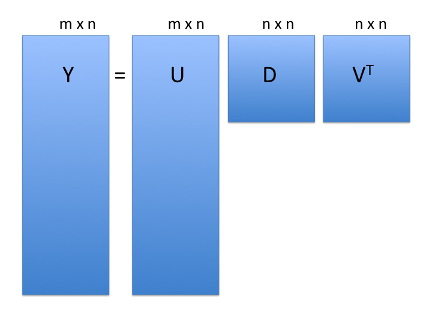

```{r setup, include=FALSE}
knitr::opts_chunk$set(eval = TRUE, cache=TRUE)
```

## 제4일차 개요

[교재](https://genomicsclass.github.io/book/) 8장:

- 고차원에서의 거리
- 주성분 분석 및 특이값 분해
- 다차원 척도법
- 배치 효과 (10장)

## 측정 지표와 거리

**측정 지표**는 다음 다섯 가지 속성을 만족합니다:

1. 비음수성 $d(a, b) \ge 0$
2. 대칭성 $d(a, b) = d(b, a)$
3. 동일성 표시 $d(a, a) = 0$
4. 한정성 $d(a, b) = 0$은 $a=b$인 경우에만 해당
5. 삼각 부등식 $d(a, b) + d(b, c) \ge d(a, c)$

- **거리**는 1-3만 만족하면 됩니다.
- **유사도 함수**는 1-2를 만족하며 $a$와 $b$가 유사해질수록 **증가**합니다.
- **비유사도 함수**는 1-2를 만족하며 $a$와 $b$가 유사해질수록 **감소**합니다.


## 유클리드 거리 (측정 지표)

- 초등학교 시절을 기억해 보세요:
```{r, echo=FALSE, fig.height=3.5}
rafalib::mypar()
plot(
    c(0, 1, 1),
    c(0, 0, 1),
    pch = 16,
    cex = 2,
    xaxt = "n",
    yaxt = "n",
    xlab = "",
    ylab = "",
    bty = "n",
    xlim = c(-0.25, 1.25),
    ylim = c(-0.25, 1.25)
)
lines(c(0, 1, 1, 0), c(0, 0, 1, 0))
text(0, .2, expression(paste('(A'[x] * ',A'[y] * ')')), cex = 1.5)
text(1, 1.2, expression(paste('(B'[x] * ',B'[y] * ')')), cex = 1.5)
text(-0.1, 0, "A", cex = 2)
text(1.1, 1, "B", cex = 2)
```
<center>
유클리드 거리 d = $\sqrt{ (A_x-B_x)^2 + (A_y-B_y)^2}$.
</center>

- **참고**: *$L_2$ 노름*이라고도 합니다.

## 고차원에서의 유클리드 거리

```{r, echo = FALSE, message=FALSE}
if(!require(tissuesGeneExpression)){
  BiocManager::install("genomicsclass/tissuesGeneExpression")
}
if(!require(GSE5859)){
  BiocManager::install("genomicsclass/GSE5859")
}
```

```{r}
## BiocManager::install("genomicsclass/tissuesGeneExpression") # 필요한 경우
## BiocManager::install("genomicsclass/GSE5859") # 필요한 경우
library(GSE5859)
library(tissuesGeneExpression)
data(tissuesGeneExpression)
dim(e) ##gene expression data # 유전자 발현 데이터
table(tissue) ##tissue[i] corresponds to e[,i] # tissue[i]는 e[,i]에 해당
```

유사한 *표본*과 유사한 *유전자*를 식별하는 데 관심이 있습니다.

## 고차원에서의 유클리드 거리에 대한 참고 사항

- 점들은 더 이상 데카르트 평면에 있지 않습니다.
- 대신 더 높은 차원에 있습니다. 예를 들어:
    - 표본 $i$는 22,215차원 공간의 한 점으로 정의됩니다: $(Y_{1,i},\dots,Y_{22215,i})^\top$.
    - 특징 $g$는 189차원 공간의 한 점으로 정의됩니다: $(Y_{g,189},\dots,Y_{g,189})^\top$.

2차원과 마찬가지로 유클리드 거리. 예: 두 표본 $i$와 $j$ 사이의 거리는 다음과 같습니다:

$$ \mbox{dist}(i,j) = \sqrt{ \sum_{g=1}^{22215} (Y_{g,i}-Y_{g,j })^2 } $$

그리고 두 특징 $h$와 $g$ 사이의 거리는 다음과 같습니다:

$$ \mbox{dist}(h,g) = \sqrt{ \sum_{i=1}^{189} (Y_{h,i}-Y_{g,i})^2 } $$

## 행렬 대수 표기법에서의 유클리드 거리

표본 $i$와 $j$ 사이의 유클리드 거리는 다음과 같이 쓸 수 있습니다:

$$ \mbox{dist}(i,j) = \sqrt{ (\mathbf{Y}_i - \mathbf{Y}_j)^\top(\mathbf{Y}_i - \mathbf{Y}_j) }$$

여기서 $\mathbf{Y}_i$와 $\mathbf{Y}_j$는 각각 $i$열과 $j$열입니다.

```{r}
t(matrix(1:3, ncol = 1))
matrix(1:3, ncol = 1)
t(matrix(1:3, ncol = 1)) %*% matrix(1:3, ncol = 1)
```

## R의 행렬 대수에 대한 참고 사항

* R은 행렬 대수에 매우 효율적입니다.
* 매우 큰 행렬의 경우 다음을 참조하십시오:
    + [Matrix](https://CRAN.R-project.org/package=Matrix) CRAN 패키지 (희소 행렬)
    + [rhdf5](https://bioconductor.org/packages/rhdf5/) 및 [DelayedArray](https://bioconductor.org/packages/DelayedArray/) Bioconductor 패키지 (디스크 상의 배열)

## 3개 표본 예시

```{r}
kidney1 <- e[, 1]
kidney2 <- e[, 2]
colon1 <- e[, 87]
sqrt(sum((kidney1 - kidney2) ^ 2))
sqrt(sum((kidney1 - colon1) ^ 2))
```

## dist()를 사용한 3개 표본 예시

```{r}
dim(e)
(d <- dist(t(e[, c(1, 2, 87)])))
class(d)
```

## dist() 함수

?dist 발췌:

```{r, eval=FALSE}
dist(
    x,
    method = "euclidean", # 거리 측정 방법: "euclidean", "maximum", "manhattan", "canberra", "binary", "minkowski" 중 하나
    diag = FALSE, # 대각 행렬 요소 포함 여부
    upper = FALSE, # 상삼각 행렬 요소 포함 여부
    p = 2 # 민코프스키 거리에 대한 거듭제곱 (method = "minkowski"일 때만 사용)
)
```

- **method:** 사용할 거리 측정 방법입니다.
    - "euclidean", "maximum", "manhattan", "canberra", "binary" 또는 "minkowski" 중 하나여야 합니다. 모호하지 않은 하위 문자열을 지정할 수 있습니다.
- `dist()`의 `dist` 클래스 출력은 많은 군집화 알고리즘과 히트맵 함수에 사용됩니다.

*주의*: `dist(e)`는 `r nrow(e)` x `r nrow(e)` 행렬을 생성하며, 이는 R 세션을 중단시킬 수 있습니다.

## 표준화에 대한 참고 사항

- 실제로는 특징(예: 유전자)이 일반적으로 "표준화"됩니다. 즉, z-점수로 변환됩니다:

$$x_{gi} \leftarrow \frac{(x_{gi} - \bar{x}_g)}{s_g}$$

- 이는 특징 간의 전체 수준 차이가 종종 생물학적 효과가 아닌 기술적 효과(예: GC 편향, PCR 증폭 효율 등) 때문이기 때문입니다.
- 유클리드 거리와 $1-r$(피어슨 상관 계수)은 관련이 있습니다:
    - $\frac{d_E(x, y)^2}{2m} = 1 - r_{xy}$
    - $m$ = 차원 수

## 차원 축소 및 PCA

* 차원 축소의 동기

쌍둥이 키 시뮬레이션:
```{r}
set.seed(1)
n <- 100
y <- t(MASS::mvrnorm(n, c(0, 0), matrix(c(1, 0.95, 0.95, 1), 2, 2)))
dim(y)
cor(t(y))
```

## 쌍둥이 데이터 시각화

```{r, echo=FALSE}
z1 = (y[1,] + y[2,]) / 2 #the sum # 합계
z2 = (y[1,] - y[2,])   #the difference # 차이

z = rbind(z1, z2) #matrix now same dimensions as y # 이제 y와 동일한 차원의 행렬

thelim <- c(-3, 3)
rafalib::mypar(1, 2)

plot(
    y[1,],
    y[2,],
    xlab = "쌍둥이 1 (표준화된 키)",
    ylab = "쌍둥이 2 (표준화된 키)",
    xlim = thelim,
    ylim = thelim,
    main = "원본 쌍둥이 키"
)
points(y[1, 1:2], y[2, 1:2], col = 2, pch = 16)

plot(
    z[1,],
    z[2,],
    xlim = thelim,
    ylim = thelim,
    xlab = "평균 키",
    ylab = "키 차이",
    main = "수동 PCA 유사 투영"
)
points(z[1, 1:2] , z[2, 1:2], col = 2, pch = 16)
```

## 두 번째 차원에서는 거리가 많이 손실되지 않습니다.

```{r, echo=FALSE}
rafalib::mypar()
d = dist(t(y))
d3 = dist(z[1, ]) * sqrt(2) ##distance computed using just first dimension mypar(1,1) # 첫 번째 차원만 사용하여 계산된 거리
plot(as.numeric(d),
     as.numeric(d3),
     xlab = "2차원에서의 쌍별 거리",
     ylab = "1차원에서의 쌍별 거리")
abline(0, 1, col = "red")
```

- 쌍둥이 키의 평균 키만 사용할 경우 키 차이가 많이 손실되지 않습니다.
    - 쌍둥이 키는 상관 관계가 매우 높기 때문입니다.

## 특이값 분해 (SVD)

SVD는 우리가 살펴본 예시 회전을 일반화합니다:

$$\mathbf{Y} = \mathbf{UDV}^\top$$

<center>

</center>

- **참고**: 위 공식은 $m$ 행 > $n$ 열인 경우에 해당합니다.

- $\mathbf{Y}$: $m$ 행 x $n$ 열 측정값 행렬
- $\mathbf{U}$: $m \times n$ 행렬, 원본 점수를 PCA 점수와 연관시킴 (**가중치**)
- $\mathbf{D}$: $n \times n$ 대각 행렬 (**고유값**)
- $\mathbf{V}$: $n \times n$ *직교* 행렬 (**고유 벡터 또는 PCA 점수**)
    - 직교 = 단위 길이 및 3차원에서 "수직"

## 유전자 발현 데이터 세트의 SVD

척도 조정:
```{r, cache=TRUE}
system.time(e.standardize.slow <-
                t(apply(e, 1, function(x)
                    x - mean(x))))
system.time(e.standardize.fast <- t(scale(t(e), scale = FALSE)))
all.equal(e.standardize.slow[, 1], e.standardize.fast[, 1])
```

SVD:
```{r}
s <- svd(e.standardize.fast)
names(s)
```

## SVD 결과의 구성 요소

```{r}
dim(s$u)     # loadings # 가중치
length(s$d)  # eigenvalues # 고유값
dim(s$v)     # d %*% vT = scores # 점수
```
<center>

</center>

## PCA는 SVD입니다

* 유전자 발현 데이터 세트

```{r, cache=TRUE}
rafalib::mypar()
p <- prcomp(t(e.standardize.fast))
plot(s$u[, 1] ~ p$rotation[, 1])
```

**교훈:** u와 v는 각각 -1을 임의로 곱할 수 있습니다.

## PCA 해석: 가중치

<center>

</center>

- $\mathbf{U}$ (**가중치**): *주성분* 축을 원본 변수와 연관시킵니다.
    - 주성분 축을 원본 축의 가중 조합으로 생각하십시오.

## PCA 가중치 시각화

```{r}
plot(p$rotation[, 1],
     xlab = "유전자 색인",
     ylab = "PC1 가중치",
     main = "각 유전자의 PC1 가중치") #or, predict(p) # 또는 predict(p)
abline(h = c(-0.03, 0.03), col = "red")
```

## PC1 가중치가 높은 유전자

```{r, fig.height=3.5}
e.pc1genes <-
    e.standardize.fast[p$rotation[, 1] < -0.03 |
                           p$rotation[, 1] > 0.03,]
pheatmap::pheatmap(
    e.pc1genes,
    scale = "none", # 척도 조정 없음
    show_rownames = TRUE, # 행 이름 표시
    show_colnames = FALSE # 열 이름 표시 안 함
)
```

## PCA 해석: 고유값

- $\mathbf{D}$ (**고유값**): 각 분해된 변수에 곱해지는 표준 편차 척도 인수입니다.

```{r, fig.height=3, fig.width=5, echo=TRUE, fig.align='center'}
rafalib::mypar()
plot(
    p$sdev ^ 2 / sum(p$sdev ^ 2) * 100,
    xlim = c(0, 150),
    type = "b",
    ylab = "설명된 분산 비율 (%)",
    main = "스크리 그림"
)
```

## PCA 해석: 고유값

또는 누적 설명 분산 비율 ( `cumsum()` 함수 사용)

```{r, fig.height=4, echo=TRUE, fig.align='center'}
rafalib::mypar()
plot(
    cumsum(p$sdev ^ 2) / sum(p$sdev ^ 2) * 100,
    ylab = "누적 설명 분산 비율 (%)",
    ylim = c(0, 100),
    type = "b",
    main = "누적 스크리 그림"
)
```

## PCA 해석: 점수

<center>

</center>

- $\mathbf{V}$ (**점수**): 축소된 주성분 공간의 "데이터 포인트"입니다.
- 일부 구현(예: `prcomp()`)에서는 점수가 이미 고유값으로 척도 조정되었습니다: $\mathbf{D V^T}$

## PCA 해석: 점수

```{r, fig.height=5, echo=FALSE}
rafalib::mypar()
plot(
    p$x[, 1:2],
    xlab = "PC1",
    ylab = "PC2",
    main = "p$x[, 1:2] 그림",
    col = factor(tissue),
    pch = as.integer(factor(tissue))
)
legend(
    "topright",
    legend = levels(factor(tissue)),
    col = 1:length(unique(tissue)),
    pch = 1:length(unique(tissue)),
    bty = 'n'
)
```

## 다차원 척도법 (MDS)

- 주좌표 분석 (PCoA)이라고도 합니다.
- 거리 행렬에서 수행되는 축소된 SVD입니다.
- 거리를 보존하는 두 개 이상의 고유값/고유 벡터를 식별합니다.

```{r}
d <- as.dist(1 - cor(e.standardize.fast))
mds <- cmdscale(d)
```

```{r, echo=FALSE}
rafalib::mypar()
plot(mds, col = factor(tissue), pch = as.integer(factor(tissue)))
legend(
    "topright",
    legend = levels(factor(tissue)),
    col = 1:length(unique(tissue)),
    bty = 'n',
    pch = 1:length(unique(tissue))
)
```

## 요약: 거리 및 차원 축소

- **참고**: 고유값(제곱하여 분산 구함)과 고유 벡터(가중치)의 부호는 임의로 뒤집힐 수 있습니다.
- PCA와 MDS는 **상관 관계가 있는 변수**가 있을 때 차원 축소에 유용합니다.
- 변수는 항상 중앙에 맞춰집니다.
- 변수는 모집단에서 동일한 척도를 갖는다는 것을 알지 못하는 한 척도 조정됩니다.
- 행렬 계산을 알고 있다면 PCA 투영을 새 데이터 세트에 적용할 수 있습니다.
- PCA는 과적합되기 쉬우므로 스크리 그림은 교차 검증으로 테스트할 수 있습니다.

## PCA 및 MDS 연습문제

1. 분산이 가장 낮은 특징의 절반을 제거한 후 PCA를 반복합니다. 다르게 보이나요?
2. 피어슨 상관 관계 대신 스피어만 상관 관계를 사용하여 MDS를 반복합니다. 다르게 보이나요?

## 배치 효과

- 유전체학에서 널리 퍼져 있습니다 (예: [Leek *et al.* Nat Rev Genet. 2010 Oct;11(10):733-9.](https://www.ncbi.nlm.nih.gov/pubmed/?term=20838408)).
- DNA 및 RNA 시퀀싱, 단백체학, 이미징, 마이크로어레이에 영향을 미칩니다.
- 세간의 이목을 끄는 문제와 철회를 야기했습니다.
    - 제거할 수 없습니다.
    - 그러나 실험과 혼동되지 않도록 할 수 있습니다.
    
## 배치 효과 - 예시

- Nat Genet. 2007 Feb;39(2):226-31. Epub 2007 Jan 7.
- 제목: *일반적인 유전적 변이가 인종 그룹 간의 유전자 발현 차이를 설명합니다.*
    - "결과는 인구 집단 간의 특정 유전적 변이가 유전자 발현 표현형의 차이에 상당히 기여함을 보여줍니다."

```{r, message=FALSE}
library(Biobase)
library(genefilter)
library(GSE5859) ## BiocInstaller::biocLite("genomicsclass/GSE5859")
data(GSE5859)
geneExpression = exprs(e)
sampleInfo = pData(e)
```

* 참고: `ExpressionSet` 객체는 더 이상 사용되지 않으며 이제 `SummarizedExperiment`를 사용합니다.

## 배치의 대리 변수로서의 처리 날짜

- 표본 메타데이터에는 *처리 날짜*가 포함되었습니다:

```{r}
head(table(sampleInfo$date))
```

```{r}
year <-  as.integer(format(sampleInfo$date, "%y"))
year <- year - min(year)
month = as.integer(format(sampleInfo$date, "%m")) + 12 * year
table(year, sampleInfo$ethnicity)
```

## PCA를 사용한 배치 효과 시각화

```{r, cache=TRUE, warning=FALSE}
pc <- prcomp(t(geneExpression), scale. = TRUE)
boxplot(
    pc$x[, 1] ~ month,
    varwidth = TRUE, # 상자 너비를 표본 크기에 비례하게 조정
    notch = TRUE, # 중앙값 신뢰 구간 노치 표시
    main = "PC1 점수 대 월",
    xlab = "월",
    ylab = "PC1"
)
```

## MDS를 사용한 배치 효과 시각화

색상 팔레트의 시작점:
```{r, eval=FALSE}
RColorBrewer::display.brewer.all(n = 3, colorblindFriendly = TRUE) # 색맹 친화적인 3색 팔레트 표시
```

정량적 팔레트에서 월별로 하나의 색상 보간:
```{r}
col3 <- c(RColorBrewer::brewer.pal(n = 3, "Greys")[2:3], "black")
MYcols <- colorRampPalette(col3, space = "Lab")(length(unique(month)))
```

```{r, fig.height=3.5, fig.align='center'}
d <- as.dist(1 - cor(geneExpression))
mds <- cmdscale(d)
plot(mds, col = MYcols[as.integer(factor(month))],
     main = "월별 음영 처리된 MDS")
```

## 배치 효과가 군집화에 미치는 영향

```{r}
hcclass <- cutree(hclust(d), k = 5)
table(hcclass, year)
```

## 배치 효과 - 요약

- 많은 또는 모든 측정값에 약간의 영향을 미치는 경향이 있습니다.
- 실험 설계 중:
    - 사후 분석을 위해 배치 효과를 유발할 수 있는 모든 것을 추적합니다.
    - 각 배치에 대조군 표본을 포함합니다.
- 연구 설계에서 무작위화된 경우 배치를 수정할 수 있습니다.
    - 치료 또는 관심 결과와 혼동되는 경우 도움이 될 수 없습니다.
- Bioconductor [sva](https://bioconductor.org/packages/sva/) 패키지 (대리 변수 분석)를 참조하십시오.
- 기계 학습 / 예측 모델링의 맥락에서 배치 효과 수정을 권장하지 않습니다.
    - 그러나 정확도 추정을 위해서는 독립적인 데이터 세트만 신뢰하십시오.

## 링크

- 이 강의의 빌드된 [html][] 버전이 제공됩니다.
- [소스][] R Markdown은 Github에서도 제공됩니다.

[html]: https://rpubs.com/lwaldron/AppStatBio2021_day4
[source]: https://github.com/waldronlab/AppStatBio
